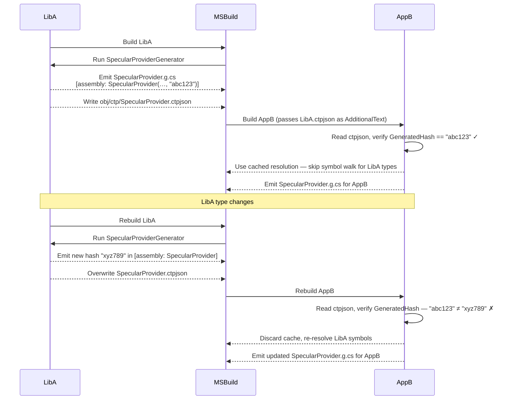

# Cross-Assembly Caching

## The Problem

In a multi-project solution, the same upstream library types may be referenced by many downstream assemblies. Without caching, every downstream assembly that calls `GetTypes` or `Scan` would force the generator to re-walk the same upstream `ITypeSymbol` graph independently during each project's build. In large solutions this is redundant work that compounds with every additional consuming project.

## The Solution: `SpecularProvider.ctpjson`

The constant `Constants.SpecularProviderCacheFileName` (defined in `CompiledTypeProviderGenerator.cs`) equals `"SpecularProvider.ctpjson"`. After the generator resolves all scan results for an assembly, it serialises the full resolution into this JSON file and writes it to the project's intermediate output path under an `obj/ctp/` subdirectory.

The JSON is structured as `GeneratedAssemblyProviderData`, which holds:

- **`AssemblyData`** — a dictionary keyed by assembly metadata name, mapping to `CompiledAssemblyProviderData`. Each entry carries the internal assembly/reflection/service-descriptor requests and a `CacheVersion` string used for invalidation.
- **`EmptyAssemblies`** — the set of assemblies that contained no matching types (so downstream can short-circuit without re-visiting them).
- **`Partials`** — per-selector-hash resolved source locations, keyed by the hash of the call-site source location.

The serialisation uses `JsonSourceGenerationContext` (source-generated JSON) so the analyzer itself has no reflection dependency.

## How the Cache Is Consumed

When a downstream assembly builds, MSBuild passes the upstream project's `SpecularProvider.ctpjson` as an `AdditionalText` to the downstream generator run. The generator reads it early in the pipeline:

```csharp
var generatedJsonProvider = context.AdditionalTextsProvider
    .Where(z => Path.GetFileName(z.Path)
        .Equals(Constants.SpecularProviderCacheFileName, StringComparison.OrdinalIgnoreCase))
    .Select((text, _) => JsonSerializer.Deserialize(
        text.GetText(_)?.ToString(),
        JsonSourceGenerationContext.Default.GeneratedAssemblyProviderData))
    .Collect()
    .Select((z, _) => z.SingleOrDefault() ?? /* empty */);
```

Inside `AssemblyProviderConfiguration`, before visiting any upstream `ITypeSymbol`, the generator calls `GeneratedAssemblyProviderData.GetAssemblyData(assembly)`. If the cache entry exists **and** its `CacheVersion` matches the upstream assembly's current version, the cached resolution is used directly — no symbol walking occurs for that assembly.

## Cache Invalidation via `GeneratedHash`

Every assembly that has been processed by Specular carries an assembly-level attribute:

```csharp
[assembly: SpecularHashAttribute("abc123…")]
```

The constructor argument is the `GeneratedHash` — a hash of the generator's output computed by `AssemblyProviderBuilder`. When Specular reads a cached entry from `ctpjson`, it compares the upstream assembly's `GeneratedHash` (read from its `SpecularHashAttribute` via Roslyn's `GetAttributes()`) against the `CacheVersion` stored in the JSON:

```csharp
public bool MatchesCachedVersion(this IAssemblySymbol assembly, string? cacheVersion) =>
    assembly.GetCachedVersion() is not { Length: > 0 } version || version == cacheVersion;
```

`GetCachedVersion` first looks for the `SpecularHashAttribute` hash; if absent it falls back to `AssemblyInformationalVersionAttribute`. A mismatch means the upstream types changed after the cache was written — the downstream generator discards the cached entry and re-resolves from source.

## Two-Project Example



## Failure Modes

| Situation                                                                             | Behaviour                                                                                                                                             |
| ------------------------------------------------------------------------------------- | ----------------------------------------------------------------------------------------------------------------------------------------------------- |
| `ctpjson` is missing or has fewer than 100 characters                                 | Generator treats it as an empty/invalid cache and falls back to full symbol resolution for all upstream assemblies                                    |
| `GeneratedHash` in `ctpjson` does not match the upstream assembly's current attribute | Cache entry is discarded; that assembly is re-resolved from source symbols                                                                            |
| Multiple upstream assemblies each provide a `ctpjson`                                 | Only one `ctpjson` is expected per generator run (`Collect().Select(z => z.SingleOrDefault()…)`); MSBuild must be configured to pass the correct file |

In all fallback cases the build produces correct output — the cache is purely an optimisation. A build warning may be emitted if the cache file is present but unreadable.
