# How It Works

Specular replaces runtime reflection-based assembly scanning with a **Roslyn `IIncrementalGenerator`** that runs during your build. By the time your application starts, all type and assembly scan results are pre-computed and baked into generated C# — there is nothing to resolve at runtime.

## Overview

When you write code like this:

```csharp
provider.GetTypes(s => s.FromAssemblyOf<MyService>().AddClasses().AsMatchingInterface())
```

Specular's generator finds that call during compilation, evaluates the selector expression against the Roslyn symbol graph, and emits a concrete implementation that returns the pre-computed results directly. No reflection, no startup cost, and full AOT/trimming compatibility.

## The Three Syntax Providers

`SpecularProviderGenerator` (in `CompiledTypeProviderGenerator.cs`) registers three distinct syntax providers during `Initialize`, one for each method on `ISpecularProvider`:

| Syntax Provider               | Handles                                |
| ----------------------------- | -------------------------------------- |
| `AssemblyCollection`          | `provider.GetAssemblies(…)` call sites |
| `ReflectionCollection`        | `provider.GetTypes(…)` call sites      |
| `ServiceDescriptorCollection` | `provider.Scan(…)` call sites          |

Each provider scans the syntax tree for its corresponding method invocation, extracts the selector expression, and passes it downstream for resolution.

## Call Site Detection

Each `ISpecularProvider` method carries hidden compiler-injected parameters:

```csharp
IEnumerable<Type> GetTypes(
    Func<IReflectionTypeSelector, IEnumerable<Type>> selector,
    [CallerLineNumber]   int lineNumber = 0,
    [CallerFilePath]     string filePath = "",
    [CallerArgumentExpression(nameof(selector))] string argumentExpression = ""
);
```

The `[CallerArgumentExpression]` attribute causes the compiler to pass the **literal text of the selector lambda** as a string. The generator reads that text and hashes it with `GetArgumentExpressionHash`, which normalises whitespace before computing an MD5 hash. This hash is the stable key that links a specific call site to its generated output — change the lambda text and the hash changes, triggering re-generation.

## Symbol Visitor Walk

For each call site, the generator resolves which types satisfy the selector by walking the Roslyn `ITypeSymbol` graph. The `AssemblyProviders/` directory contains the visitors and compiled filters that do this work:

- **`TypeSymbolVisitor`** — walks the type hierarchy of an assembly, accumulating matching `INamedTypeSymbol` instances. It exposes `GetReferencedTypes` (walks all referenced assemblies) and `GetCompilationTypes` (walks the current compilation only).
- **`CompiledTypeFilter` / `CompiledAssemblyFilter`** — evaluate individual filter predicates: namespace scoping, type kind (class, interface, enum…), attribute presence, assignability to a base type or interface, and name patterns.
- **`FindTypeVisitor` / `FindTypeInAssembly`** — locate specific types needed for assignability checks across assembly boundaries.

The net result is a precise, build-time enumeration of every type that would have been returned by the equivalent runtime reflection call.

## Code Emission

After resolving all call sites, the generator builds a single `SpecularProvider.g.cs` file containing:

1. A concrete class that implements `ISpecularProvider`, with each method returning a hard-coded collection for its call-site hash.
2. An `[assembly: SpecularHashAttribute("…hash…")]` attribute that embeds a `GeneratedHash` for cross-assembly cache validation.

The generated provider is exposed through the static `SpecularProvider.Instance` property — you call into it directly, with zero reflection scanning.

## Incremental Rebuild

Because Specular uses Roslyn's `IIncrementalGenerator` API, the pipeline is fully incremental. Call sites whose selector expression text has not changed produce no re-computation. Only modified selectors, or changes to the types a selector matches, cause re-emission. In large solutions this means the generator adds negligible time to incremental builds.

## Pipeline Diagram

```mermaid
flowchart TD
    A[User calls provider.GetTypes&#40;selector&#41;] --> B[Roslyn IIncrementalGenerator]
    B --> C{Three Syntax Providers}
    C -->|GetAssemblies| D[AssemblyCollection]
    C -->|GetTypes| E[ReflectionCollection]
    C -->|Scan| F[ServiceDescriptorCollection]
    D & E & F --> G[Hash selector expression at call site]
    G --> H[Symbol visitor walks ITypeSymbol graph]
    H --> I[Apply compiled filters]
    I --> J[Emit SpecularProvider.g.cs]
    J --> K[Zero reflection at runtime]
```



## Next Steps

To understand how scan results are shared across project references without redundant symbol resolution, see [Cross-Assembly Caching](./cross-assembly-caching.md).
